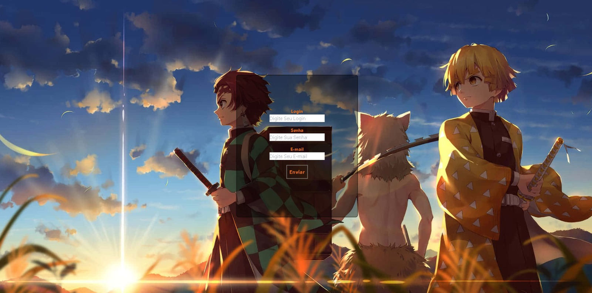

#Titulo
Login Demon Slayer

##Descricao
Login Básico onde o usuário coloca um login, senha e
e-mail onde é enviado na tela mostrando que foi concluido.

foi construindo utilizando TAILWINDCSS para estilizar 
a aplicação e deixando responsivo também, foi utilizado JAVASCRIPT para interação com o botão para mostrar na tela assim que clicar .

foi construindo para por em prática o que aprendi o básico de tailwindcss e assim ter na prática experiência para aplicar direto no html a estilização.

